# Getting Started

This code is for a Raspberry Pi Pico and assumes prior setup of the microcontroller and Thonny IDE. If you haven't done so yet, please refer to [Board Setup](#board-setup).

# Table of Contents

- [About](#about)
- [How to Use](#how-to-use)
- [Popular Links](#popular-links)
- [Download Instructions](#download-instructions)
- [Bonus Pico Tips](#pico-tips)
  - [Using a Power Supply](#using-a-power-supply)
  - [Wiring Diagrams with Fritzing](#wiring-diagrams-with-fritzing)
- [Board Setup](#board-setup)

# About

This collection of MicroPython examples and Raspberry Pi Pico H wiring diagrams was created for the First Year Engineering Learning & Innovation Center (FYELIC) at Northeastern University.

Each example file uses singular components for ease of use, but of course can be modified to create scripts that incorporate multiple components.

# How to Use

For each component in the "examples" folder, there is a folder containing the sample code and a wiring diagram. The wiring diagram will help you set up your Pico and component properly to work with the given sample code.

In the case that you need to use different pins, make sure you're changing the code to reflect the right pin number. Also make sure the pin number you choose is the same type of pin needed for the component.

# Popular Links

https://lastminuteengineers.com/
https://projects.raspberrypi.org/en/projects/getting-started-with-the-pico 
https://randomnerdtutorials.com/projects-raspberry-pi-pico/ 

# Download Instructions

# Pico Tips

This section contains additional notes on using a Raspberry Pi Pico.

## Raspberry Pi Pico H Wiring Guide

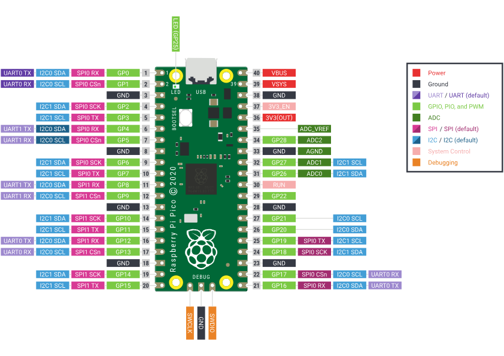

**What are the different pins for?**

**Power:** The 3V3(OUT) pin provides a 3.3V power output.

The VBUS (USB Power Input) is the micro-USB input voltage. So, if you’re powering the Raspberry Pi Pico via the USB port using 5V, you’ll get 5V on the VBUS pin.

VSYS (External Power Input) is the main system input voltage. VSYS minimum input is 1.8V and maximum is 5.5V.

**Ground:** Used to create a reference point of 0 V. Note that the AGND pin is used as Ground for an ADC.

**Additional Pin Types:**

| Acronym | Full Name                                   | Use Case                                                                                                    |
| ------- | ------------------------------------------- | ----------------------------------------------------------------------------------------------------------- |
| UART    | Universal Asynchronous Receiver/Transmitter | Receive and transmit data; Serial communication.                                                            |
| GPIO    | General Purpose Input/Output                | Pins that can be configured for input or output.                                                            |
| PWM     | Pulse Width Modulation                      | Control power delivered to device by varying width of a pulse.                                              |
| ADC     | Analog to Digital Converter                 | Converts an analog signal (light, sound, etc.) and turns it into a digital signal.                          |
| SPI     | Serial Peripheral Interface                 | Communication between a controller device and a peripheral device.                                          |
| I2C     | Inter-integrated Circuit                    | Send and receive data between devices using two lines: a serial clock pin (SCL) and a serial data pin (SDA) |

Need further explanation? Here's a good website with more details: [Pinout Explained](https://randomnerdtutorials.com/raspberry-pi-pico-w-pinout-gpios/)

## Using a Power Supply

If you want to run your Raspberry Pi Pico without it being attached to your computer, you can use a power supply. FYELIC offers a 2.5A Power Supply that can be plugged into a wall, or you can use a USB power bank.

To automatically run a MicroPython program when the Pico powers up, you can save it to the Pico with the name `main.py`

In Thonny, make sure your program isn't running by pressing 'Stop'.

Click on the **File** menu and then **Save as** for the last program you wrote. Or you can open a previously saved file and follow the same process to rename the file.

When prompted, select ‘Raspberry Pi Pico’ from the pop-up menu asking where you want to save the file to.

Name your file `main.py`

You can now disconnect your Raspberry Pi Pico from your computer and use a micro USB cable to connect it to your power source.

Once connected, the `main.py` file should run automatically.

## Wiring Diagrams with Fritzing

# Board Setup

This guide is based on this tutorial [Getting Started with Raspberry Pi Pico](https://projects.raspberrypi.org/en/projects/getting-started-with-the-pico/0) with additional guidance.

## Download Thonny

Thonny is a free and open-source integrated development environment for Python that is designed for beginners.

In a web browser, navigate to [thonny.org](https://thonny.org/).

In the top right-hand corner of the browser window, you will see download links for Windows and macOS, and instructions for Linux.


Download the relevant files and run them to install Thonny.

**Note:** Do not open Thonny yet.

## Add the MicroPython firmware.

Find the BOOTSEL button on your Raspberry Pi Pico.
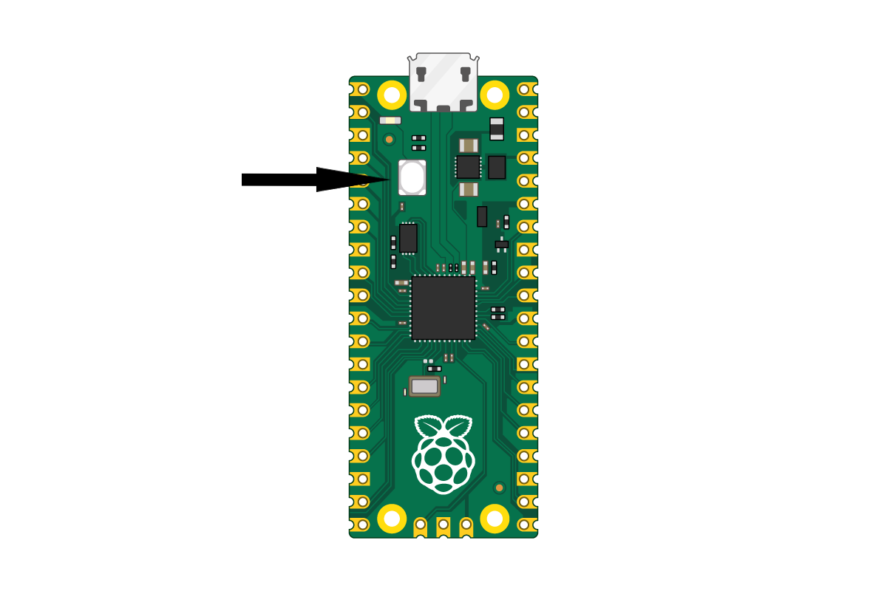

Press the BOOTSEL button and hold it while you connect the other end of the micro USB cable to your computer. This puts your Raspberry Pi Pico into USB mass storage device mode.

Open Thonny. It should look something like this:

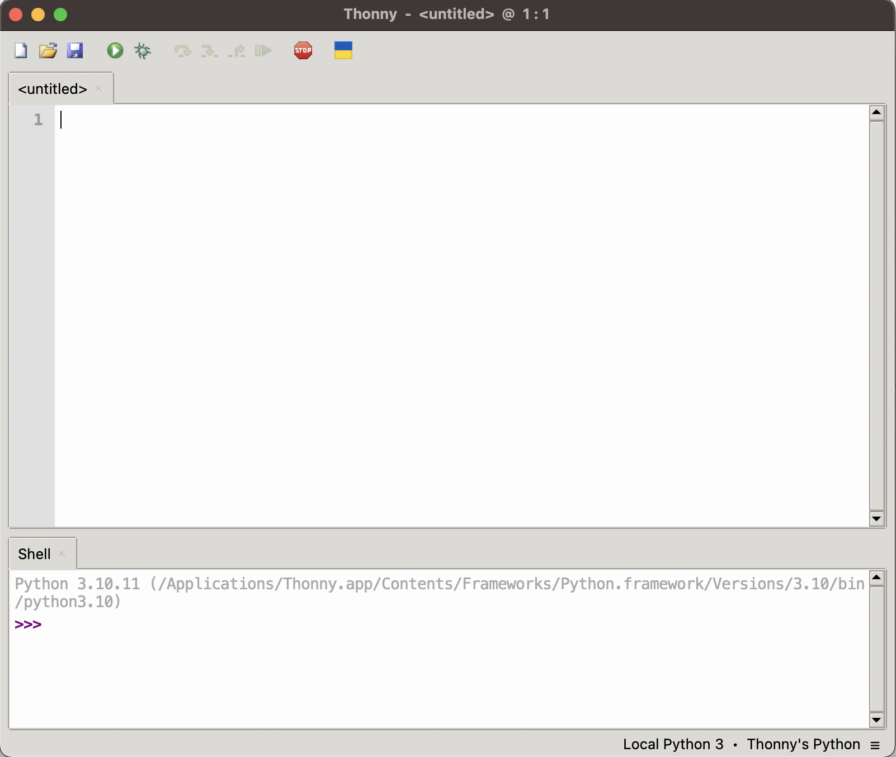

In the bottom right corner of the Thonny window, you will see the interpreter used to run the code you write in Thonny.

By default, Thonny uses the interpreter on the ‘Local’ computer (the one running Thonny).

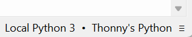

Click the Python interpreter and select Install MicroPython.

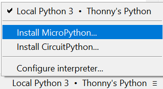

A dialog box will pop up to install the latest version of the MicroPython firmware on your Raspberry Pi Pico.

Select the variant and the version should be the latest, so leave it set at that. FYELIC uses Raspberry Pi Pico H.
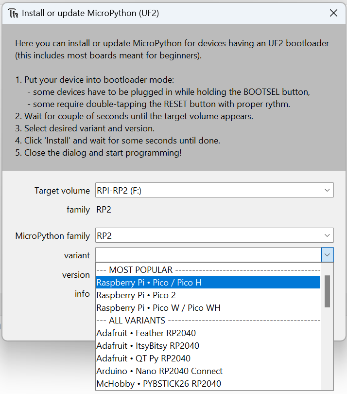

Click the **Install** button to copy the firmware to your Raspberry Pi Pico.

Wait for the installation to complete and click **Close**.

You don’t need to update the firmware every time you use your Raspberry Pi Pico. Next time, you can just plug it into your computer without pressing the ‘BOOTSEL’ button.

Before code is written, the Picozero library should be added to Thonny. 

Go to Tools --> Manage Packages.
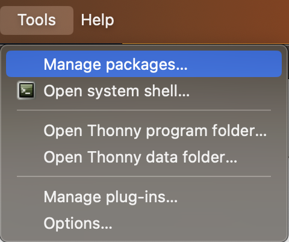

A menu that looks like this should open up:
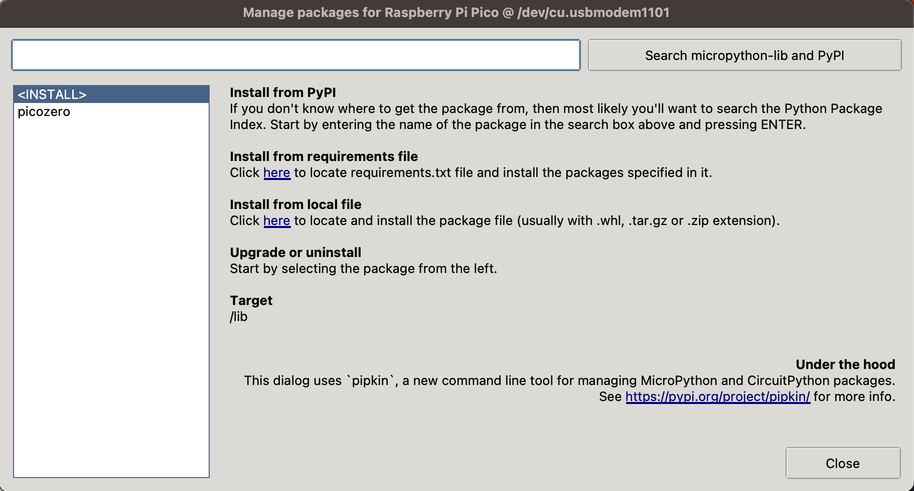

Look up picozero in the Search Bar and select the top option in Search Results. On the picozero page, click **Install** and close the menu.


## Blink the Onboard LED.

Use the Thonny Shell to run some simple Python code on your Raspberry Pi Pico.

Make sure that your Raspberry Pi Pico is connected to your computer and you have selected the MicroPython (Raspberry Pi Pico) interpreter.

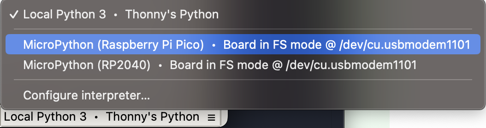

Look at the Shell panel at the bottom of the Thonny editor.

You should see something like this:
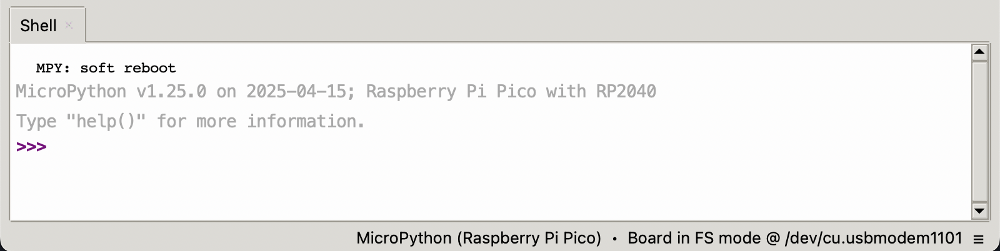

Enter this code in the Shell, making sure you tap Enter after each line.

```
from picozero import pico_led

pico_led.on()
```

After entering the code, the Shell should look like this:
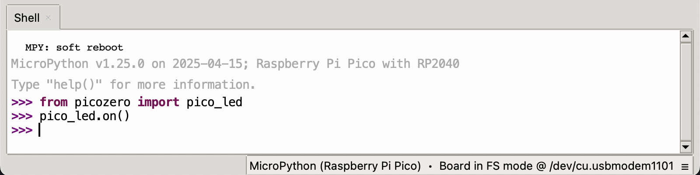

If everything is done properly, the board should look like this:
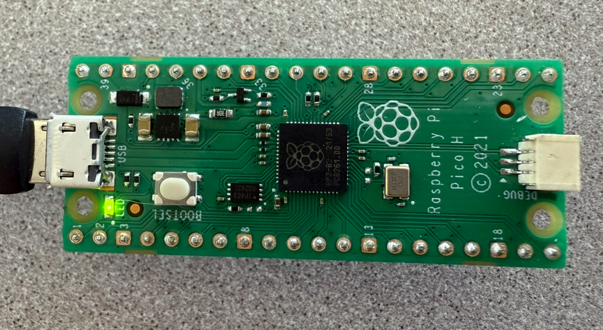


To turn off the LED, you can enter this line in the Shell:

```
pico_led.off()
```

## Write a longer program.

The Shell is useful to make sure everything is working and try out quick commands. However, it’s better to put longer programs in a file.

Thonny can save and run MicroPython programs directly on your Raspberry Pi Pico.

Create a MicroPython program to blink the onboard LED on and off in a loop.

Click in the main editor pane of Thonny.
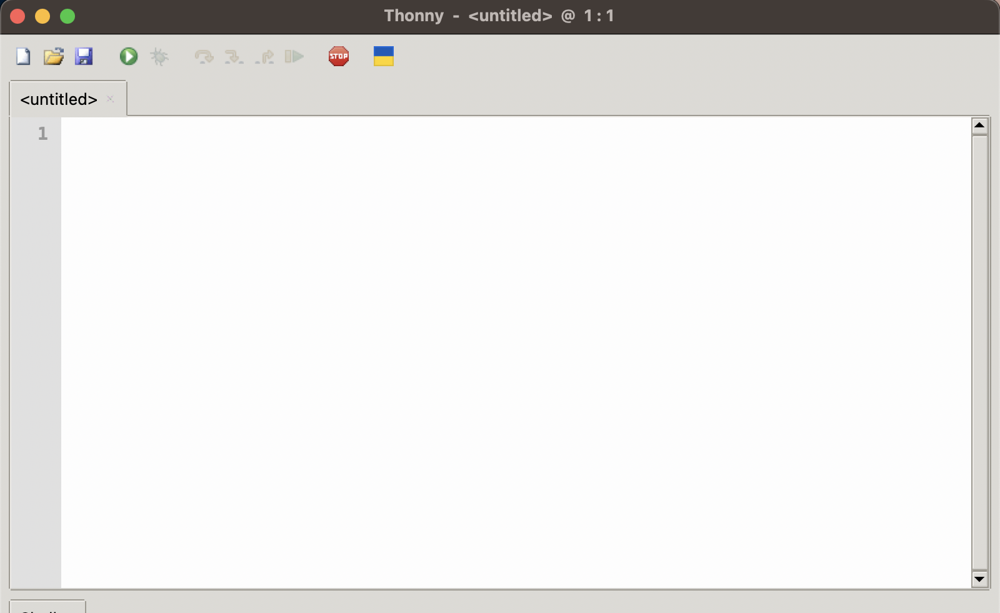

Enter this code into the main editor:

```
from picozero import pico_led

while True:
    pico_led.blink()
```

Click **Run** (the green play button) and the LED will blink on and off.

Click the **Stop** (the red stop sign) button.

## Save your program to your Pico

Make sure you have Stopped the program, then click the ‘Save’ icon, or choose ‘Save’ from the ‘File’ menu.

Thonny will give you the option to save the file on **This computer**, or the **Raspberry Pi Pico**.

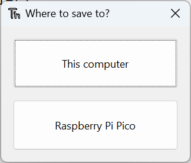

Choose either save option, but make sure that your filename ends with the `.py` extension so that it's recognized as a Python file.

**Debug:** If you get an error saying the device is busy, you need to first ‘Stop’ 🛑 the program running on the Pico.

You've officially set up your Raspberry Pi Pico and Thonny! To start working on your projects, refer back to the [Table of Contents](#table-of-contents)
