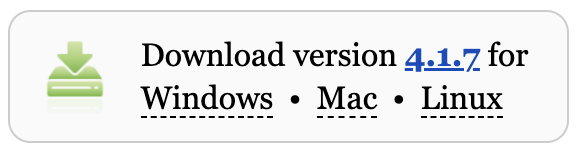

# Getting Started

This code is for a Raspberry Pi Pico and assumes prior setup of the microcontroller and Thonny IDE. If you haven't done so yet, please refer to [Board Setup](#board-setup).

# Table of Contents

- [About](#about)
- [How to Use](#how-to-use)
- [Popular Links](#popular-links)
- [Download Instructions](#download-instructions)
- [Board Setup](#board-setup)

# About

# How to Use

# Popular Links

# Download Instructions

# Board Setup

This guide is based on this tutorial [Getting Started with Raspberry Pi Pico](https://projects.raspberrypi.org/en/projects/getting-started-with-the-pico/0) with additional guidance.

## Download Thonny

Thonny is a free and open-source integrated development environment for Python that is designed for beginners.

In a web browser, navigate to [thonny.org](https://thonny.org/).

In the top right-hand corner of the browser window, you will see download links for Windows and macOS, and instructions for Linux.


Download the relevant files and run them to install Thonny.

**Note:** Do not open Thonny yet.

## Add the MicroPython firmware.

Find the BOOTSEL button on your Raspberry Pi Pico.


Press the BOOTSEL button and hold it while you connect the other end of the micro USB cable to your computer. This puts your Raspberry Pi Pico into USB mass storage device mode.

Open Thonny. It should look something like this:


In the bottom right corner of the Thonny window, you will see the interpreter used to run the code you write in Thonny.

By default, Thonny uses the interpreter on the ‘Local’ computer (the one running Thonny).


Click the Python interpreter and select Install MicroPython.


A dialog box will pop up to install the latest version of the MicroPython firmware on your Raspberry Pi Pico.

Select the variant and the version should be the latest, so leave it set at that. FYELIC uses Raspberry Pi Pico H.


Click the **Install** button to copy the firmware to your Raspberry Pi Pico.

Wait for the installation to complete and click **Close**.

You don’t need to update the firmware every time you use your Raspberry Pi Pico. Next time, you can just plug it into your computer without pressing the ‘BOOTSEL’ button.

## Blink the Onboard LED.

Use the Thonny Shell to run some simple Python code on your Raspberry Pi Pico.

Make sure that your Raspberry Pi Pico is connected to your computer and you have selected the MicroPython (Raspberry Pi Pico) interpreter.


Look at the Shell panel at the bottom of the Thonny editor.

You should see something like this:


Enter this code in the Shell, making sure you tap Enter after each line.

```
from picozero import pico_led

pico_led.on()
```

After entering the code, the Shell should look like this:


If everything is done properly, the board should look like this:


If you're getting an error with picozero, go to the Tools bar and select manage packages.


A menu that looks like this should open up:


Look up picozero in the Search Bar and select the top option in Search Results. On the picozero page, click **Install** and close the menu.

To turn off the LED, you can enter this line in the Shell:

```
pico_led.off()
```

## Write a longer program.

The Shell is useful to make sure everything is working and try out quick commands. However, it’s better to put longer programs in a file.

Thonny can save and run MicroPython programs directly on your Raspberry Pi Pico.

Create a MicroPython program to blink the onboard LED on and off in a loop.

Click in the main editor pane of Thonny.


Enter this code into the main editor:

```
from picozero import pico_led

while True:
    pico_led.blink()
```

Click **Run** (the green play button) and the LED will blink on and off.

Click the **Stop** (the red stop sign) button.

## Save your program to your Pico

Make sure you have Stopped the program, then click the ‘Save’ icon, or choose ‘Save’ from the ‘File’ menu.

Thonny will give you the option to save the file on **This computer**, or the **Raspberry Pi Pico**.


Choose either save option, but make sure that your filename ends with the `.py` extension so that it's recognized as a Python file.

**Debug:** If you get an error saying the device is busy, you need to first ‘Stop’ 🛑 the program running on the Pico.

You've officially set up your Raspberry Pi Pico and Thonny! To start working on your projects, refer back to the [Table of Contents](#table-of-contents)
